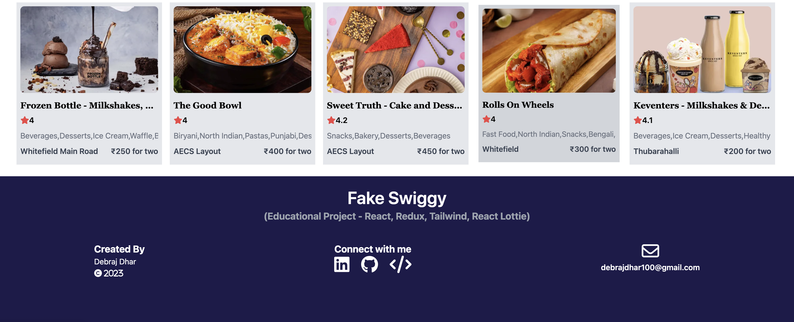
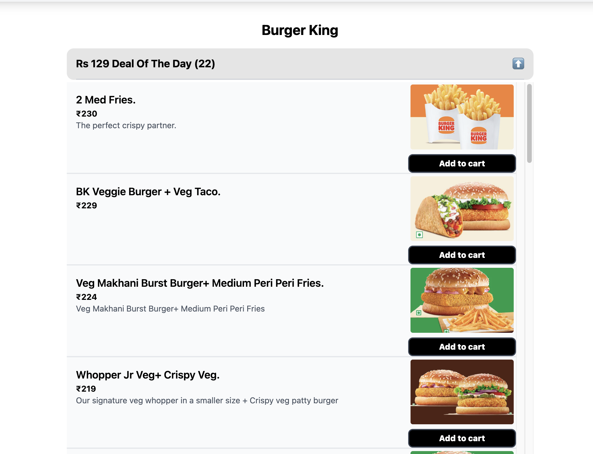
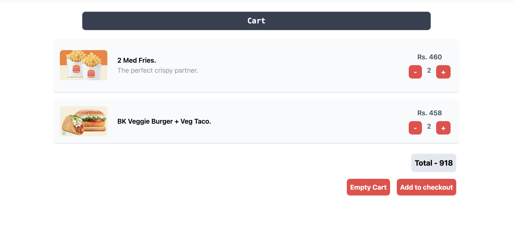

# FakeSwiggy 🔥🐱

A project built with **React, Redux, Tailwind** on the user interface, and **SWIGGY API WITH CORS extension for Google Chrome** to provide a food ordering application for the users.

## Technologies Used -

- 
- 
- 

## Live Demo Link 🚀

### `https://fake-swiggy.vercel.app/` (Kindly install CORS google chrome extension to view the live API workings)

## Setup Guide -

In the project directory, you can run the following commands to run the project after cloning the repo to your local machine:

- Install dependencies: `npm install`
- Install CORS Chrome extention and enable it.
- Run the project: `npm start`

## Image Samples:

### Front Page -

### Menu Page -

### Cart Page -

## NOTE -

- If the "Restaurants" in the front page is not loading then it means the SWIGGY API changed.
- You can find the SWIGGY API and add the respective URLs to the `src/utils/constants.js` file in case the old link is not working anymore.
